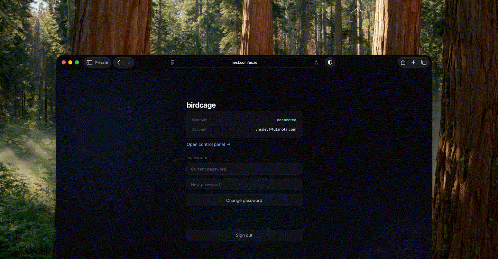

# birdcage

Secure remote access layer for personal AI. One user, one claw, accessible from any browser, privately.

[](https://github.com/vhscom/birdcage/actions/workflows/ci.yml)
[](https://go.dev/)
[](COPYING)

```
Browser ──────► Birdcage (VPS) ────► OpenClaw (home)
        cookie  auth + proxy   mesh  WireGuard agent
```

A claw is a local AI assistant like [OpenClaw](https://github.com/openclaw/openclaw) running on your home machine. Birdcage lets you reach it from anywhere after authenticating. Traffic is encrypted over WireGuard — your claw never touches the public internet.



## Quick start

**On the VPS** (point your domain's DNS A record to the server first):

```sh
mkdir -p /opt/birdcage && cd /opt/birdcage
birdcage init     # generates .env with secrets, WireGuard keypair, and registration token
# edit .env — set GATEWAY_URL to the claw's mesh address (e.g. http://10.0.0.2:18789)
sudo birdcage serve
```

**On the home machine** (next to the claw):

```sh
birdcage agent init https://your-vps.example.com <agent-key>
sudo birdcage agent
```

Open `https://your-vps.example.com` in a browser and register with the token printed during init.

## What it does

**Auth layer** — Token-gated registration (single owner), login with PBKDF2-SHA384 (210K iterations), adaptive proof-of-work on brute force, JWT dual-token pattern with refresh token rotation and reuse detection, session management with sliding expiry, OWASP security headers.

**Control proxy** — HTTP reverse proxy and WebSocket bridge to the claw's web UI. Strips credentials before forwarding, injects gateway token into WebSocket connect frames.

**WireGuard mesh** — Server provisions its own WireGuard interface and coordinates peers. Agent runs at home alongside the claw, manages WireGuard, discovers endpoints via STUN, falls back to relay when direct UDP fails, rotates keys on a configurable interval.

## CLI

```
birdcage init                          Generate server config (.env)
birdcage serve                         Start the server
birdcage serve install                 Install as system service
birdcage serve uninstall               Remove system service
birdcage agent                         Run the WireGuard mesh agent
birdcage agent init <server> <key>     Save agent config
birdcage agent install                 Install as system service
birdcage agent uninstall               Remove system service
```

## Building

Requires Go 1.26+.

```sh
go build -o birdcage .
```

Single binary, pure Go, no CGO.

## TLS

When `BASE_URL` starts with `https://`, Birdcage automatically obtains a TLS certificate from Let's Encrypt. No reverse proxy needed.

- Listens on `:443` (HTTPS) and `:80` (ACME HTTP-01 challenges + redirect)
- Renews the certificate ~30 days before expiry
- Stores certificates in `./certs` (override with `CERT_DIR`)
- Falls back to TLS-ALPN-01 if port 80 is unavailable

Requirements: DNS A/AAAA record pointing to the server, ports 443 and 80 available.

For local development, use `BASE_URL=http://localhost:8080` (the default).

## Safe deployment

- **Keep generated secrets.** `birdcage init` generates 256-bit secrets and a registration token. Don't replace them with weaker values. The server refuses to start if JWT secrets are under 32 characters.

## Design principles

- **Single user, single purpose.** No multi-tenancy, no admin roles, no user management beyond the owner.
- **Privacy by architecture.** Oauth-free. Traffic between the VPS and your home machine is encrypted via WireGuard.
- **One binary.** Server, agent, CLI — same executable, different subcommands.
- **No magic.** `birdcage init` shows you what it creates. `birdcage serve` does what it says. One `.env`, one database.
- **Secure by default.** HTTPS is automatic. Cookies are SameSite=Strict. Headers are OWASP. PoW activates under attack.

## Documentation

- [Auth flows](docs/flows.md) — sequence diagrams for every authentication path
- [Threat model](docs/threat-model.md) — STRIDE analysis and JWT pitfall catalogue

## License

AGPL-3.0 — see [COPYING](COPYING).
