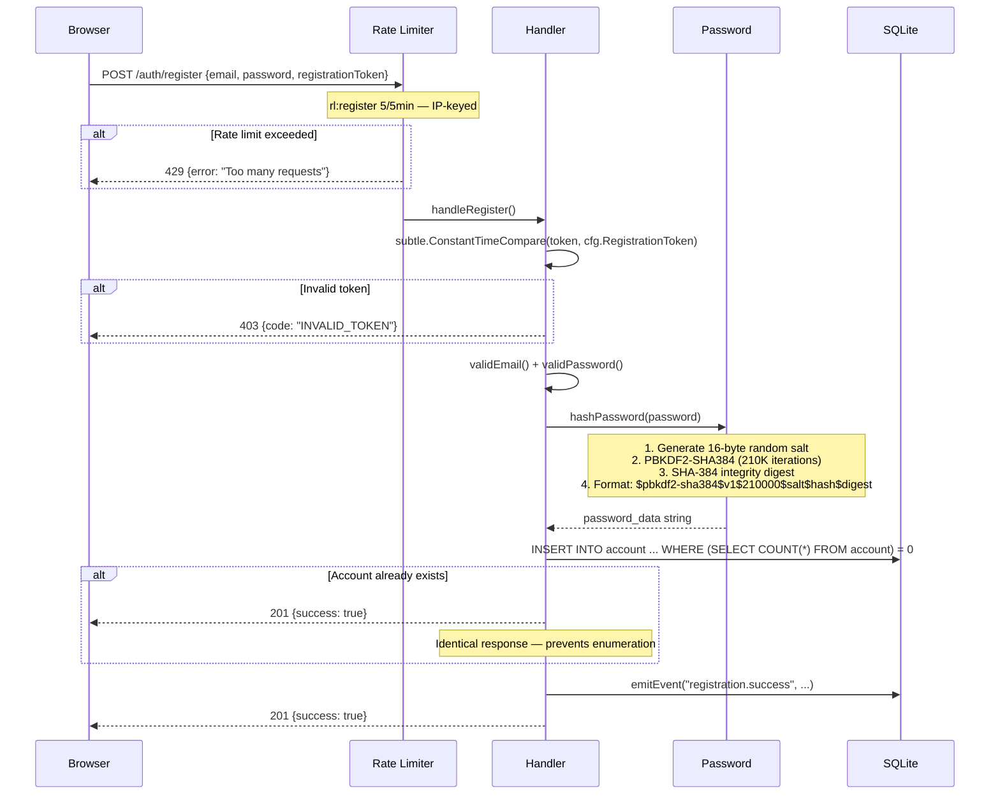
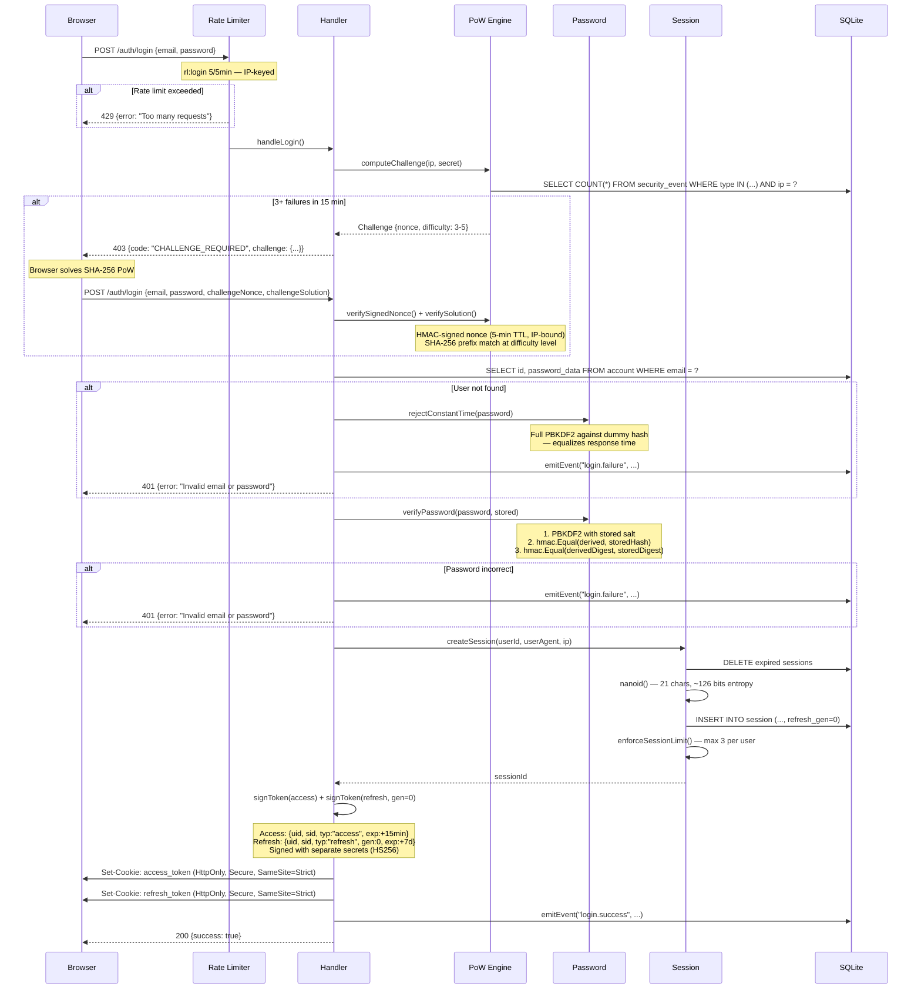
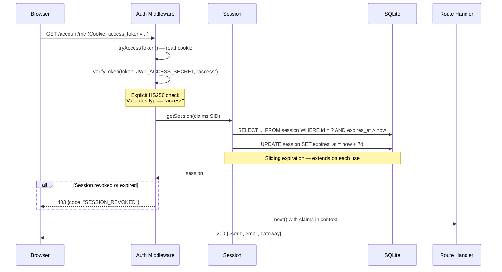
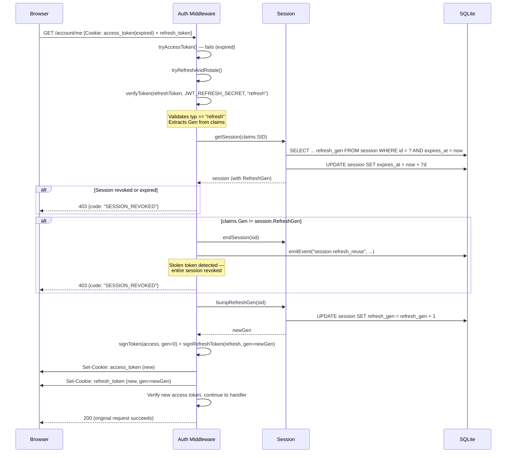
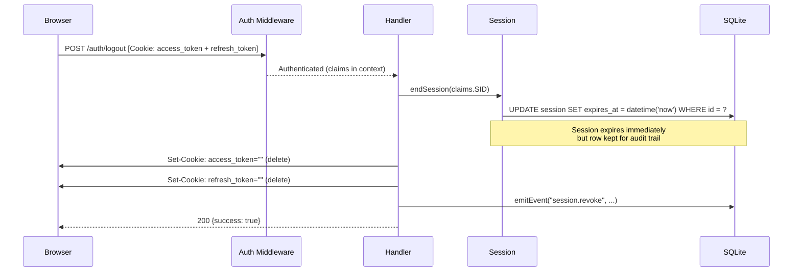
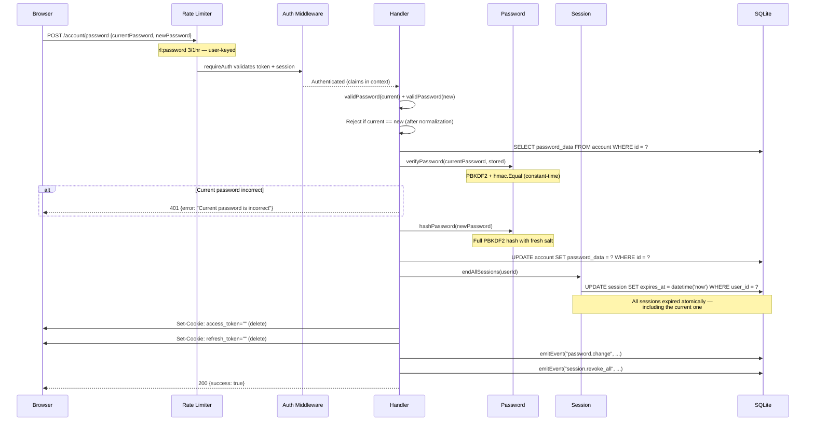

# Authentication Flow Diagrams

Sequence diagrams for every authentication flow in Birdcage. Each diagram maps directly to source code in the root package.

> **Rate limiting:** Fixed-window middleware gates public auth routes before any business logic runs. Requests exceeding the threshold receive `429 Too Many Requests` with a `Retry-After` header.

> **Rendering:** GitHub renders Mermaid natively. For local preview, use the [Mermaid Live Editor](https://mermaid.live) or a VS Code extension.

---

## 1. Registration

Owner creates the single account. Requires a registration token generated by `birdcage init`.

**Source:** [`auth.go:11-51`](../auth.go) | [`crypto.go:29-43`](../crypto.go) | [`respond.go:50-64`](../respond.go)

---

## 2. Login

Full authentication flow from credential verification through token issuance. Includes adaptive proof-of-work when brute-force is detected.

**Source:** [`auth.go:54-102`](../auth.go) | [`events.go:82-151`](../events.go) | [`session.go:25-71`](../session.go) | [`crypto.go:46-70`](../crypto.go)

---

## 3. Normal API Request

Accessing a protected endpoint with a valid access token.

**Source:** [`middleware.go:42-60`](../middleware.go) | [`session.go:73-95`](../session.go)

---

## 4. Token Refresh with Reuse Detection

When the access token expires, the middleware transparently refreshes both tokens. A generation counter detects stolen token replay.

**Source:** [`middleware.go:70-109`](../middleware.go) | [`crypto.go:107-117`](../crypto.go) | [`session.go:109-118`](../session.go)

---

## 5. Logout

Ends the server-side session and clears both auth cookies.

**Source:** [`auth.go:105-111`](../auth.go) | [`session.go:97-101`](../session.go)

---

## 6. Password Change

Requires re-verification of the current password even though the user is authenticated. All sessions are revoked afterward, forcing re-authentication on every device.

**Source:** [`auth.go:114-153`](../auth.go) | [`session.go:103-107`](../session.go) | [`crypto.go:29-43`](../crypto.go)
